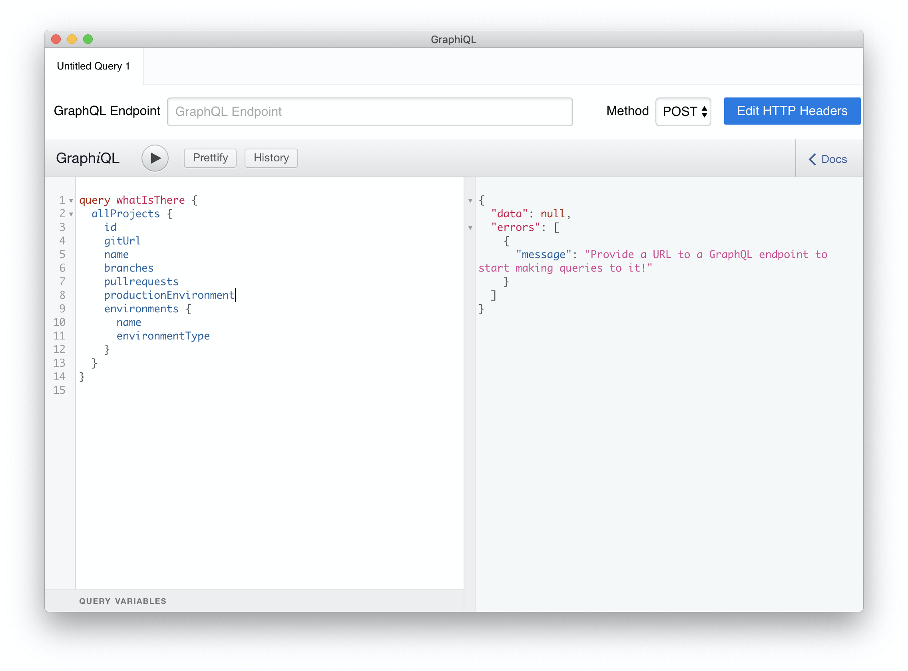

# GraphQL

## Connect to GraphQL API

API interactions in Lagoon are done via GraphQL. In order to authenticate to the API, you need a JWT \(JSON Web Token\), which will authenticate you against the API via your SSH public key.

To generate this token, use the remote shell via the `token` command:

```bash
ssh -p [PORT] -t lagoon@[HOST] token
```

Example for amazee.io:

```bash
ssh -p 32222 -t lagoon@ssh.lagoon.amazeeio.cloud token
```

This will return a long string, which is the JWT token.

We also need the URL of the API endpoint. Ask your Lagoon administrator for this.

On amazee.io this is [`https://api.lagoon.amazeeio.cloud/graphql`](https://api.lagoon.amazeeio.cloud/graphql).

Now we need a GraphQL client! Technically this is just HTTP, but we suggest GraphiQL. It has a nice UI that allows you to write GraphQL requests with autocomplete. Download, install and start it. \[[GraphiQL App](https://github.com/skevy/graphiql-app)\]

Enter the API endpoint URL. Then click on "Edit HTTP Headers" and add a new Header:

* "Header name": `Authorization`
* "Header value": `Bearer [jwt token]` \(make sure that the JWT token has no spaces, that won't work\)


Close the HTTP Header overlay \(press ESC\) and now you are ready to make your first GraphQL Request!

Enter this on the left window:

```graphql
query whatIsThere {
  allProjects {
    id
    gitUrl
    name
    branches
    pullrequests
    productionEnvironment
    environments {
      name
      environmentType
    }
  }
}
```

And press the ▶️button \(or press CTRL+ENTER\).



If all went well, you should see your first GraphQL response.

## Mutations

The Lagoon GraphQL API cannot only display objects and create objects, but it also has the capability to update existing objects. All of this happens in full GraphQL best practices manner.

Update the branches to deploy within a project:

```graphql
mutation editProjectBranches {
  updateProject(input:{id:109, patch:{branches:"^(prod|stage|dev|update)$"}}) {
    id
  }
}
```

Update the production environment within a project:


Important: Needs a redeploy in order for all changes to be reflected in the containers.


```graphql
mutation editProjectProductionEnvironment {
  updateProject(input:{id:109, patch:{productionEnvironment:"master"}}) {
    id
  }
}
```

You can also combine multiple changes into a single query:

```graphql
mutation editProjectProductionEnvironmentAndBranches {
  updateProject(input:{id:109, patch:{productionEnvironment:"master", branches:"^(prod|stage|dev|update)$"}}) {
    id
  }
}
```

