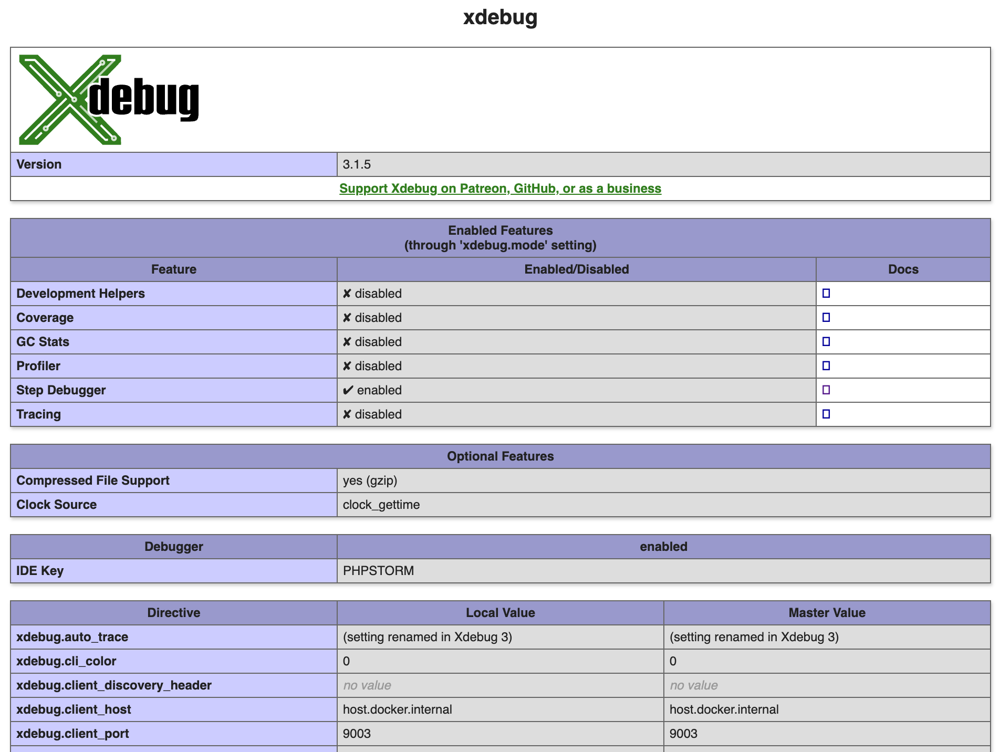

# Setting up Xdebug with Lagoon

## Enable Xdebug Extension

The Lagoon base images are pre-configured with Xdebug but, for performance
reasons, the extension is not loaded by default. To enable the extension, the
`XDEBUG_ENABLE` environment variable must be set to `true`:

- **Locally** \(pygmy and Lando\)
  1.  If your project is based off the lagoon-examples `docker-compose.yml`
      file, the environment variable already exists. Uncomment these lines:
      [https://github.com/lagoon-examples/drupal9-base/blob/main/docker-compose.yml#L16-L17](https://github.com/lagoon-examples/drupal9-base/blob/main/docker-compose.yml#L16-L17).
  2.  Make sure to rebuild and restart the containers after changing this
      setting.
- **Remotely** \(dev/prod\)
  1.  You can
      [use the Lagoon API to add the environment variable to a running environment](environment-variables.md#runtime-environment-variables-lagoon-api).
  2.  Make sure to redeploy the environment after changing this setting.

## Activate Xdebug Extension

The default Xdebug configuration requires a "trigger" to activate the extension
and start a session. You can
[view the complete documentation](https://xdebug.org/docs/step_debug#activate_debugger)
for activating the debugger but the most straightforward instructions are below.

### CLI

The `php-cli` image is configured to _always_ activate Xdebug when it’s enabled,
so there is nothing else that needs to be done. Running any PHP script will
start a debugging session.

### Web

[Install a browser extension](https://xdebug.org/docs/step_debug#browser-extensions)
to set/unset an activation cookie.

Make sure the activation cookie is set for the website you want to start
debugging.

## Configure PHPStorm

1. PHPStorm is configured correctly by default.
2. Click the “**Start Listening for PHP Debug Connections**” icon in the
   toolbar.
3. Load a webpage or run a Drush command.
4. On first run, PHPStorm should pop up a window asking you to:
   1. Confirm path mappings.
   2. Select the correct file locally that was triggered on the server.

## Configure Visual Studio Code

1. [Install the PHP Debug extension](https://marketplace.visualstudio.com/items?itemName=felixfbecker.php-debug)
   by Felix Becker.
2. [Follow the instructions](https://marketplace.visualstudio.com/items?itemName=felixfbecker.php-debug#vs-code-configuration)
   to create a basic `launch.json` for PHP.
3. Add correct path mappings. For a typical Drupal site, an example would be:

   ```json title="launch.json"
   "pathMappings": {
     "/app": "${workspaceFolder}",
   },
   ```

4. In the **Run** tab of Visual Studio Code, click the green arrow next to
   “**Listen for Xdebug**”
5. Load a webpage or run a Drush command.

## Troubleshooting

- Verify that Xdebug extension is loaded. The best way to do this on a Drupal
  site is to check the PHP status page. You should find a section about Xdebug
  and all its settings.



- Verify the following settings:

| Directive          | Local Value                               |
| :----------------- | :---------------------------------------- |
| xdebug.mode        | debug                                     |
| xdebug.client_host | `host.docker.internal` or your IP address |
| xdebug.client_port | 9003                                      |

- Verify you have the activation cookie set. You can use the browser tools in
  Chrome or Firefox to check that a `XDEBUG_SESSION` cookie is set.
- Verify that Xdebug is activated and attempting to start a debug session with
  your computer. You can use the `nc -l 9003` command line tool to open the
  Xdebug port. If everything is configured in PHP correctly, you should get a
  Xdebug init response when you load a webpage or run a Drush command.
- Verify that the `xdebug.client_host` has been set correctly. For local
  debugging with Docker for Mac, this value should be `host.docker.internal`.
  For remote debugging this value should be your IP address. If this value was
  not correctly determined, you can override it by setting the `DOCKERHOST`
  environment variable.
- Verify that Docker for Mac networking is not broken. On your host machine, run
  `nc -l 9003`, then in a new terminal window, run:

  ```bash title="Verify Docker for Mac networking"
  docker-compose run cli nc -zv host.docker.internal 9003
  ```

  You should see a message like:
  `host.docker.internal (192.168.65.2:9003) open`.

- When using Lando locally, in order to debug scripts run from the CLI you must
  first SSH into the CLI container via `lando ssh`. You won’t be able to debug
  things by running `lando drush` or `lando php`.
- You can enable the Xdebug log by setting the `XDEBUG_LOG` environment
  variable. Logs will be saved to `/tmp/xdebug.log`.

## Xdebug 2

If you're running older images you may still be using Xdebug version 2. All the
information on this page still applies, but some of the configuration names and
values have changes:

| v3                 | v2                    |                                           |
| :----------------- | :-------------------- | :---------------------------------------- |
| xdebug.mode        | xdebug.remote_enabled | On                                        |
| xdebug.client_host | xdebug.remote_host    | `host.docker.internal` or your IP address |
| xdebug.client_port | xdebug.remote_port    | 9000                                      |
