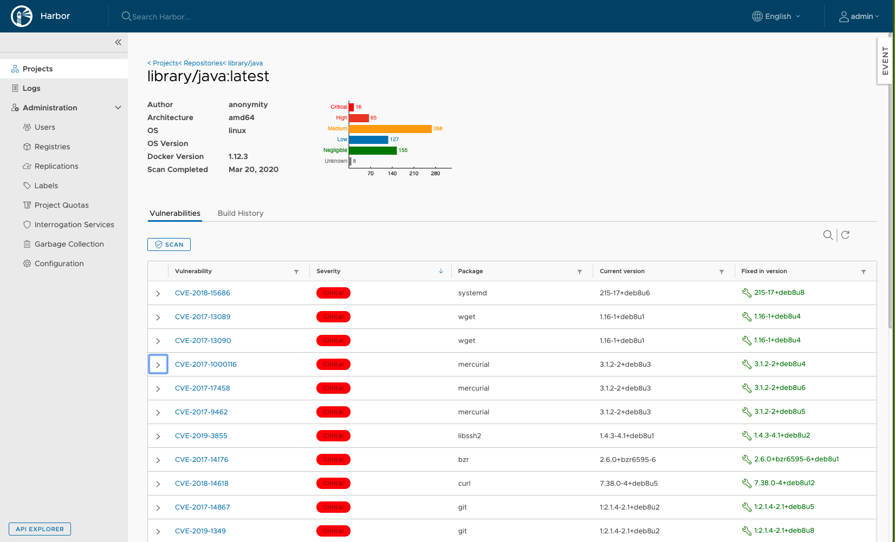

# Security Scanning

Harbor comes with a built-in security scanning solution provided by the Trivy service. This service analyzes a specified container image for any installed packages, and collects the version numbers of those installed packages. The Trivy service then searches the [National Vulnerability Database](https://nvd.nist.gov/) for any CVEs \(common vulnerabilities and exposures\) affecting those package versions. Trivy is also library aware, so it will scan any Composer files or other package library definition files and report any vulnerabilities found within those package versions. These vulnerabilities are then reported within Harbor for each individual container.

An example of a security scan in Harbor, showing applicable vulnerabilities for a scanned container:

<<<<<<< HEAD:docs/using-lagoon-advanced/using-harbor/security-scanning.md

=======

>>>>>>> 63b8d2b447941f0a1f6fae7b5e5d995e2c29ad91:docs/administering-lagoon/using-harbor/security-scanning.md
